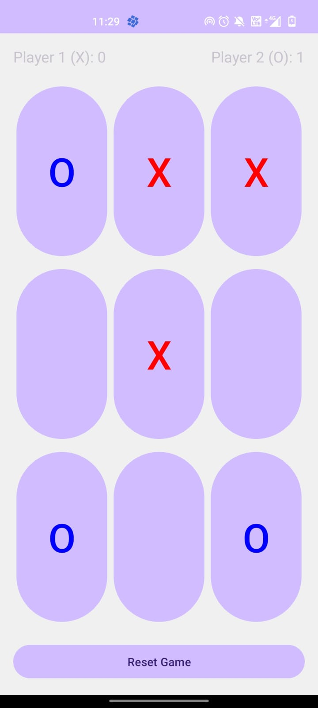

# 🎮 **Tic Tac Toe Game**  
### A Simple and Fun Two-Player Game  

---

## 📝 **Overview**  
**Tic Tac Toe Game** is a fully functional and engaging two-player game designed for easy and quick play. This app was developed as part of my **Android Development Internship** at **Prodigy InfoTech**.  

---

## ✨ **Features**  
- ✅ Simple and user-friendly interface for seamless gameplay.  
- ✅ Supports two-player mode on a single device.  
- ✅ Real-time display of the game board with X and O markers.  
- ✅ Clear indication of the winner after each game.  
- ✅ Option to restart the game once it’s completed.  

---

## 📸 **Screenshots**  
<p align="center">
    
</p>  

---

## 🛠️ **Technologies Used**  
- **IDE**: Android Studio  
- **Language**: Java  
- **UI Design**: XML  

---

## 🚀 **How to Use**  
1. Download and install the app on your Android device.  
2. Open **Tic Tac Toe Game**.  
3. Choose a player to start and take turns placing X or O on the board.  
4. The game automatically announces the winner after a player gets three markers in a row.  
5. Tap on **Restart** to start a new game.  

---

## ⚙️ **Setup Instructions**  
To clone and run this project on your local machine:  

1. Install **Android Studio**.  
2. Clone this repository:  
   ```bash  
   https://github.com/thirusudar03092003/PRODIGY_AD_04.git
